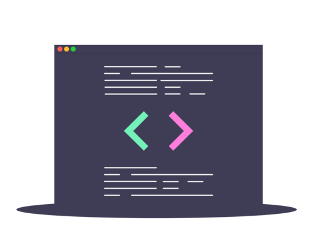
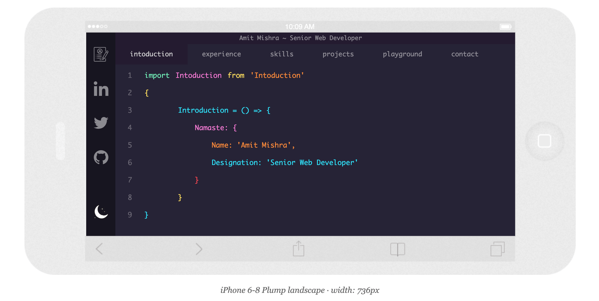
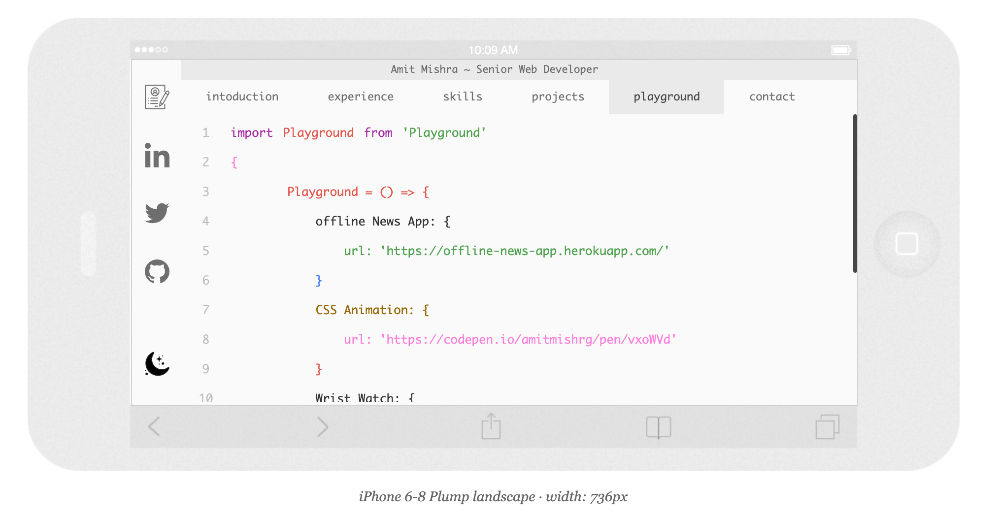
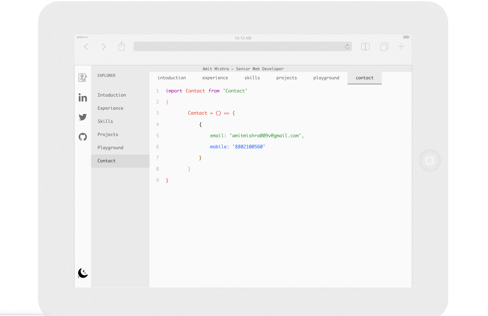

<p align="center">
    
</p>

**Build your own Resume in seconds**

# code-resume

> Create your own offline-first resume by using code-resume.

## Demo

https://code-resume.herokuapp.com/

## Preview 

**Iphone -**
<p align="center">
    
    
</p>

**Ipad -**
<p align="center">
    
</p>
<p align="center">
    
 </p>   

##Features 

**Offline-first**

**Theme support Dark & Light mode**

**Easy Customization**

**Responsive for all devices**


## Quick start

**Clone This repo using:**

<pre>git clone --depth=1 https://github.com/amitmishrg/code-resume.git <YOUR_PROJECT_NAME></pre>

Move to the appropriate directory: cd <YOUR_PROJECT_NAME>.

**Install:**

<pre>yarn install</pre>

**Run:**

<pre>yarn start-dev</pre>

**Build:**

<pre>yarn build</pre>

## Customization

For Adding your resume details:-

<pre>cd data</pre>

Then open **index.js** & change details

**Title**

```
export const Title = 'Amit Mishra ~ Senior Web Developer';

```
**Resume Details**

```
export const Resume = {
    intoduction: `{
        Add your intoduction
    }`,

    experience: `{
        Add your experience
    }`,

    skills: `{
        Add your skills
    }`

}

```

**Social Links**

```
    resume: '/resume.pdf',
    linkedin: 'https://www.linkedin.com/in/amitmishrg/',
    twitter: 'https://twitter.com/amitmishrg',
    github: 'https://github.com/amitmishrg'

```

You can add more tabs by adding details. 


## License

[MIT](LICENSE)
